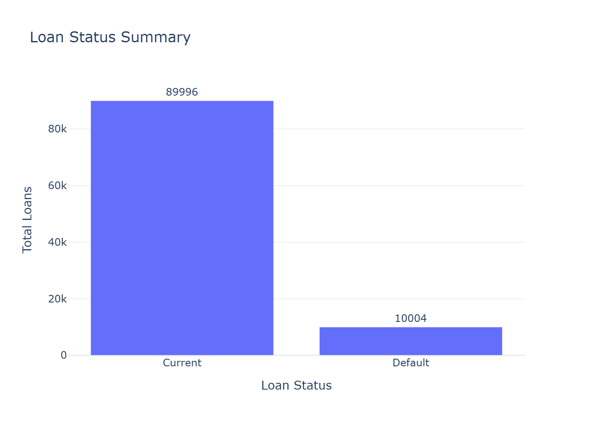
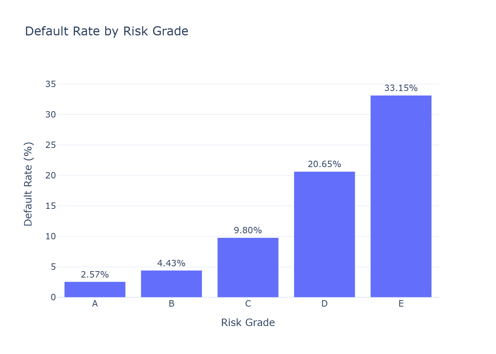
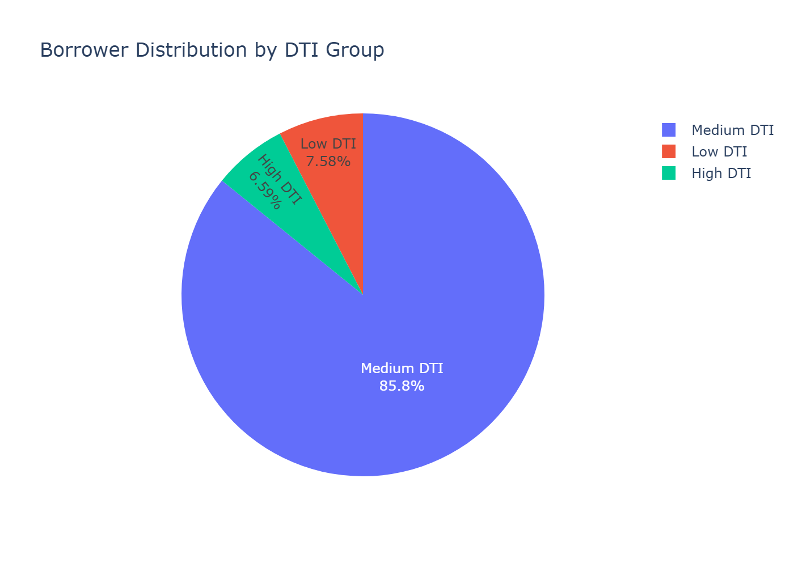

# Banking Risk and Loan Analysis using SQL

## Project Overview
This project analyzes simulated loan and borrower data using SQL, PostgreSQL, and Python-based visual reporting. The project focuses on credit risk, loan status, borrower profile, debt-to-income risk, and risk-grade reporting.

## Business Problem
Financial institutions need structured reporting to understand borrower risk, loan performance, and potential default patterns. This project creates SQL-based reporting outputs that support credit risk analysis and business decision-making.

## Tools Used
- VS Code
- SQL
- PostgreSQL
- pgAdmin
- Python
- Pandas
- Plotly
- GitHub

## Dataset
Microsoft Loan Credit Risk Dataset

Files used:
- Loan.csv
- Borrower.csv

## Project Workflow
1. Downloaded loan and borrower data from Microsoft’s public dataset.
2. Cleaned and standardized the data using Python.
3. Created PostgreSQL database tables.
4. Imported cleaned CSV files into PostgreSQL.
5. Wrote SQL validation and analysis queries.
6. Created a reporting view for credit risk analysis.
7. Generated attractive visual outputs using Python and Plotly.
8. Documented the project and uploaded it to GitHub.

## Key SQL Analysis
- Loan status summary
- Default Rate by Risk Grade
- Loan purpose risk analysis
- Debt-to-income grouping
- Borrower and loan risk profile
- High-risk borrower identification

## Key Insights
1. Loan status analysis helps identify current and charged-off loan patterns.
2. Risk grade bands help compare default risk across borrower groups.
3. Debt-to-income grouping supports borrower risk segmentation.
4. Borrower profile and loan amount together give stronger risk interpretation.
5. SQL reporting views make the analysis reusable for business reporting.

## Recommendations
1. Monitor charged-off loans by grade band and loan purpose.
2. Review borrowers with high debt-to-income ratios more carefully.
3. Use SQL validation checks before preparing credit-risk reports.
4. Build reporting views to make risk analysis repeatable and reliable.

## Repository Structure
Add your folder structure here.

## Key Visuals

### Loan Status Summary

### Default Rate by Risk Grade

### Borrower Distribution by DTI Group
